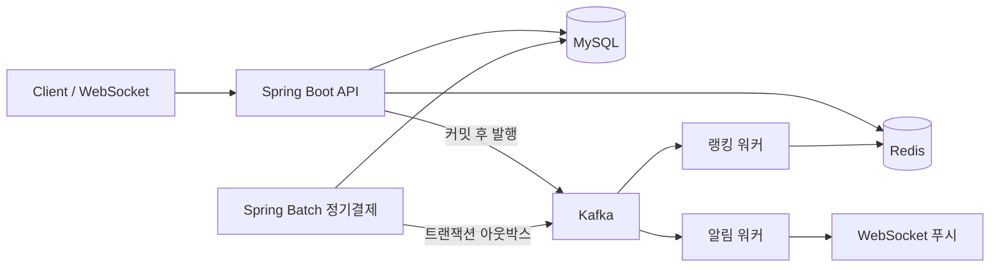

# 스터디룸 예약 시스템

스터디룸 예약을 중심으로 **이벤트 추첨 · 알림 · 실시간 랭킹 · 정기 구독권**이 파생되는 백엔드 포트폴리오.
"예약"이라는 하나의 도메인 이벤트가 4개 하위 시스템으로 전파되는 구조 위에서
**동시성 제어 · 캐싱 · 비동기 메시징 · 배치 · 실시간 통신**을 다룬다.

| | |
|---|---|
| 🔗 라이브 데모 | https://study-room-reservation-five.vercel.app |
| 📖 API (Swagger) | https://study-room-backend-vyqc.onrender.com/swagger-ui.html |
| 🔑 데모 관리자 | `admin@studyroom.local` / `admin1234` |
| 📚 문서 | [트러블슈팅](./docs/troubleshooting.md) · [성능 측정](./docs/performance.md) · [전체 설계](./docs/roadmap.md) |

> 백엔드는 Render 무료 플랜이라 15분 무접속 시 잠든다. **첫 접속은 30초~1분** 걸릴 수 있고,
> 대시보드의 "백엔드 상태"가 *운영 중* 이 되면 준비 완료.

---

## 한눈에

- **무엇** — Spring Boot 3 / Java 17 백엔드 + 기능 시연용 React 프론트. 1인 개발.
- **다루는 것** — 기능마다 *문제 재현 → 단계적 해결 → 수치로 증명* 의 과정을 [문서](./docs/troubleshooting.md)로 남겼다.

| 관심사 | 접근 | 근거 |
|---|---|---|
| 동시성 (오버부킹) | 락 없음 → DB 비관적 락 → Redisson 분산 락, 3전략 부하 비교 | 오버부킹 **10 → 1 → 1건**, 처리량 761 → 334 → 127 req/s |
| 캐싱 · 좌석 홀딩 | Redis TTL 홀딩 + keyspace 이벤트·스케줄러 백스톱, 조회 캐싱 | 룸 조회 처리량 **4.5배**, p95 81 → 36ms |
| 비동기 메시징 | Kafka + `@RetryableTopic` 지수 백오프 → DLT, `dedup_key` 멱등 | 공지 발행 p95 **~27ms**(팬아웃 무관), `failure-rate 0.3` → DLT 0.79% ≈ 0.3⁴ |
| 배치 · 멱등 | Spring Batch 정기결제 + **트랜잭션 아웃박스**(`FOR UPDATE SKIP LOCKED`) + `idempotency_key` | 동시 8스레드 → 결제 정확히 1건, 배치 50건 ~1.1s |
| 실시간 | WebSocket/STOMP 룸 현황 브로드캐스트, 추첨 결과 발표 | 구독자 20 기준 발행~수신 p95 ~70ms |

- **테스트** — 단위 + Testcontainers(MySQL·Redis·Kafka) 통합 + 동시성(`ExecutorService`) + k6 부하.
- **배포** — GitHub Actions CI, AWS EC2 1회성 검증(비용 $0.01) 후 삭제, 상시 데모는 무료 티어 조합.

---

## 아키텍처



- **Redis** — 좌석 홀딩 TTL · Redisson 분산 락 · 랭킹 Sorted Set · 조회 캐시
- **Kafka** — 알림(`@RetryableTopic` → DLT) · 랭킹 집계 · 구독 이벤트, 세 스트림
- 도메인 이벤트는 트랜잭션 커밋 이후 발행하고, 결제처럼 유실이 치명적인 경로는
  **트랜잭션 아웃박스**(`FOR UPDATE SKIP LOCKED`)로 커밋과 발행을 잇는다.

## 기술 스택

| 분류 | 사용 |
|---|---|
| 언어 · 프레임워크 | Java 17, Spring Boot 3.3.4, Gradle (Kotlin DSL) |
| 인증 | Spring Security + JWT (access + Redis refresh 회전) |
| 영속성 | JPA / Hibernate 6, Flyway, MySQL 8 |
| 캐시 · 락 | Redis 7, Redisson (분산 락 · TTL · Sorted Set) |
| 메시징 | Kafka 3.8, spring-kafka (`@RetryableTopic` → DLT), 트랜잭션 아웃박스 |
| 배치 | Spring Batch (`JpaCursorItemReader`, `faultTolerant().skip()`) |
| 실시간 | WebSocket (STOMP, 네이티브) |
| 테스트 · 부하 | JUnit5, Mockito, Testcontainers, k6 |
| 인프라 | Docker, GitHub Actions, AWS EC2 · Render · Vercel · TiDB Cloud · Upstash · Confluent Cloud |

---

## 설계 하이라이트

각 항목은 [`docs/troubleshooting.md`](./docs/troubleshooting.md) 에 *문제 → 원인 → 해결 → 검증* 타임라인으로 정리돼 있다.

### 동시성 — 오버부킹

락 없는 예약 생성에서 **같은 룸·겹치는 시간에 예약 여러 건**이 재현됐다(check-then-act 레이스).
`reservation.lock.strategy` 로 전략을 바꿔가며 부하로 비교했다.

| 전략 | 오버부킹 | 처리량 | p95 |
|---|---|---|---|
| `none` | **10건 (버그)** | 761 req/s | 49ms |
| `pessimistic` (DB 비관적 락, 기본값) | 1건 | 334 req/s | 83ms |
| `distributed` (Redisson) | 1건 | 127 req/s | 205ms |

- 단일 핫키(한 룸·한 슬롯) 20 VU. 비관적 락은 정합성 대가로 처리량 -56%, 분산 락은 -83%
  (요청마다 Redis 왕복 2회) — 대신 **앱 다중화 시** DB 락 경합이 사라진다. 배포 형태가 단일
  인스턴스라 기본값은 `pessimistic`.
- 검증: `backend/src/test/.../reservation/concurrency/` (Testcontainers) · `load-test/reservation-conflict.js`

### 캐싱과 좌석 홀딩

락으로도 "룸을 고르고 확정하기까지의 몇 분"은 못 잡는다. **Redis TTL 홀딩**(10분)으로 확정 유예를 주고,
만료는 keyspace 만료 이벤트 + 스케줄러 백스톱으로 처리한다(이벤트는 신뢰성 보장 X). 룸 목록·현황은 Redis 캐싱.

| `GET /rooms` + `/rooms/{id}/schedule` (30 VU) | 캐시 없음 | Redis 캐싱 |
|---|---|---|
| 처리량 | 408 req/s | **1,837 req/s** |
| p95 | 81ms | 36ms |

- 검증: `.../reservation/hold/`, `.../schedule/`, `.../common/cache/` · `load-test/holding-rush.js`, `room-read.js`

### 실시간 브로드캐스트

룸 현황을 바꾸는 이벤트(홀딩·예약·TTL 만료)를 그 룸을 보는 모든 클라이언트에 WebSocket 으로 즉시 알린다.
변경 지점은 `RoomChangeNotifier` 한 곳으로 모여 있어 발행 훅만 얹었다. 페이로드는 `{roomId, actorMemberId, at}`
— "바뀌었다"만 알리고 델타는 안 싣는다.

- 구독 `/topic/rooms/{roomId}`, 단일 인스턴스 SimpleBroker, 발행~수신 p95 ~70ms (구독자 20)
- 검증: `.../realtime/` (STOMP 통합 + 지연 측정)

### 비동기 알림 — 재시도 · DLT

추첨 결과와 전체 공지를 Kafka 로 발행하고 워커가 소비한다. 추첨 트랜잭션은 커밋 후 발행만 하므로
(`@TransactionalEventListener(AFTER_COMMIT)`) 추첨 응답 시간은 대상 회원 수와 무관하다.

```
추첨/공지 ─▶ notification-events ─▶ 워커 ─┬─ dedup_key 멱등 저장
                                          ├─ 발송 (실패 시 재시도)
                                          └─ WebSocket /topic/notifications/{memberId}
  실패 4회 ─▶ -retry-500 → -retry-1000 → -retry-2000 → -dlt ─▶ 이력 FAILED
```

- 멱등 `dedup_key` UNIQUE + 저장 전 조회 → at-least-once 재처리에도 1건
- `notification.delivery.failure-rate=0.3` → DLT 최종 격리율 0.79% ≈ 이론값 `0.3⁴`
- 검증: `.../notification/` (멱등·재시도/DLT는 전용 토픽으로 격리)

### 실시간 랭킹 — Redis Sorted Set

퇴실 이용시간을 회원별로 누적한다. 갱신·조회 모두 Sorted Set 이라 이력이 쌓여도 O(log N).

```
퇴실 ─(AFTER_COMMIT)─▶ usage-events ─▶ 랭킹 워커
   ├─ usage_logs 저장 (reservation_id UNIQUE = 멱등)
   └─ ZINCRBY ranking:all / ranking:daily:{date} (TTL 48h → 자정 배치 불필요)
조회: GET /api/rankings ─▶ ZREVRANGE (DB 집계 없음)
```

- 원자성: `ZINCRBY` 단일 명령 → 동시 갱신에도 정확 (10스레드 × 20회 → 정확히 200)
- 복구: Redis 유실 시 `POST /api/rankings/rebuild`(ADMIN) 가 `usage_logs` 합계로 재구축
- `GET /api/rankings` p50 12ms / `/me` p50 4ms (순수 Redis)
- `notification-events` / `usage-events` 두 스트림을 리스너별 컨테이너 팩토리로 타입 분리

### 정기결제 — Spring Batch · 트랜잭션 아웃박스 · 멱등

PRO 구독료를 매일 정기 결제한다. 결제·상태변경·이벤트 발행을 **한 트랜잭션**으로 묶어,
`@TransactionalEventListener` 뒤 브로커가 죽으면 메시지가 유실되던 틈을 메운다.

```
자정 / ADMIN 수동 ─▶ dailyBillingJob (건별 REQUIRES_NEW 커밋)
  한 트랜잭션: payments 저장 + subscription renew/PAST_DUE + outbox_events 저장
OutboxRelay (2초 폴, FOR UPDATE SKIP LOCKED) ─▶ subscription-events ─▶ published_at
```

- 멱등 `payments.idempotency_key`(`sub:{id}:{yyyy-MM}`) UNIQUE → 배치 재실행·중복 스케줄에도 1건
  (동시 8스레드 → 결제 정확히 1건)
- 내결함성 `REQUIRES_NEW` + `faultTolerant().skip()` → 실패 건만 `PAST_DUE`, 나머지 정상
- 도메인 연계: ACTIVE PRO 회원은 홀딩 유예 20분 (`HoldTtlPolicy` 포트로 예약↔구독 결합 회피)
- 배치 50건 ~1.1s, 아웃박스 드레인 < 4s · 검증: `.../subscription/` (`@SpringBatchTest` 포함)

---

## 성능

k6 로 6개 시나리오를 한 환경에서 재측정한 종합 비교: [`docs/performance.md`](./docs/performance.md).

| 시나리오 | 로컬 (처리량 / p95) | AWS EC2 t3.medium |
|---|---|---|
| 예약 `none` / `pessimistic` / `distributed` | 761 / 334 / 127 req/s | 197 / 172 / 121 req/s |
| 룸 조회 캐시 off → on | 408 → 1,837 req/s | 324 → 693 req/s |
| 랭킹 조회 | 1,423 req/s · p95 59ms | 484 req/s · p95 179ms |

> **절대 수치는 측정 환경에 종속** — t3.medium(2 vCPU)에 앱·인프라·k6 를 다 얹으니 로컬 개발 PC보다
> 오히려 낮았다. 신뢰할 수 있는 건 *같은 표 안의 상대 비교*(락 전략 격차, 캐시 배수)뿐이라는 것도
> 측정으로 확인했다.

---

## 인프라 & 배포

### CI

`main` push · PR 마다 [`.github/workflows/ci.yml`](.github/workflows/ci.yml) — backend `gradlew build`
(Testcontainers 통합 테스트 포함) / frontend 타입체크·빌드 / 배포 이미지 빌드.

### AWS EC2 — 1회성 검증 후 삭제

프리티어가 소진돼 상시 운영은 비용이 든다. 전체 스택(MySQL·Redis·Kafka·Spring Boot·nginx)을
EC2 t3.medium 에 `docker compose` 로 올려 [`deploy/verify.sh`](deploy/verify.sh) 16종을 통과시킨 뒤
**인스턴스·볼륨을 완전히 삭제**했다.

- `aws ec2 run-instances` ~ `terminate` 전 과정 CLI, 가동 ~10분, **1회성 약 $0.01**, 이후 $0
- 근거: [`docs/deploy/`](docs/deploy/) (CLI 출력·부팅 로그·`verify.sh` 로그·Kafka 컨슈머 그룹·teardown)
- 절차: [`deploy/CHECKLIST.md`](deploy/CHECKLIST.md)

### 상시 무료 배포

상단의 라이브 데모는 무료 티어 조합으로 운영되고, `main` push 시 Render·Vercel 이 자동 재배포한다.
서비스별로 실제로 마주친 이슈:

| 레이어 | 서비스 | 마주친 것 |
|---|---|---|
| 프론트 | Vercel | 백엔드와 다른 오리진 → 실제 CORS · WebSocket 오리진 검증 |
| 백엔드 | Render (Docker, 512MB/0.1CPU) | 콜드스타트 단축(`TieredStopAtLevel=1`, 커넥션 풀 축소), `PORT` 바인딩 |
| MySQL | TiDB Cloud Serverless | `SERIALIZABLE` 미지원 → Batch 잡 격리수준 조정 |
| Redis | Upstash | TLS 필수 → Redisson `rediss://` + 풀 상한 |
| Kafka | Confluent Cloud Basic | SASL_SSL/PLAIN — 커스텀 컨슈머 팩토리에 공통 보안 설정 상속 누락 디버깅 |

설정 절차: [`deploy/RENDER.md`](deploy/RENDER.md)

---

## 로컬 실행

```bash
docker compose up -d                 # MySQL(3307) · Redis · Kafka · kafka-ui(8085)
cd backend && ./gradlew bootRun      # :8080  (Windows: .\gradlew)
cd frontend && npm install && npm run dev   # :5173
```

- 헬스체크 http://localhost:8080/api/health · Swagger http://localhost:8080/swagger-ui.html
- `local` 프로파일이 데모 관리자(`admin@studyroom.local` / `admin1234`)와 룸 4개를 시드한다.
- DB 스키마는 Flyway(`backend/src/main/resources/db/migration`)가 관리. `jwt.secret` 은 `application-local.yml`
  에 개발용으로만 들어 있으니 배포 시 환경변수로 교체한다.

## 이 프로젝트에 대해

1인 포트폴리오. 백엔드가 중심이고 프론트(React + Vite)는 각 기능을 화면에서 확인하는 시연 도구다
(관리자 전용 기능은 로그인 후 `/admin`). 로드맵 1~10단계 전부 `main` 병합 —
단계별 배경은 [`docs/roadmap.md`](./docs/roadmap.md), 문제 해결 타임라인은 [`docs/troubleshooting.md`](./docs/troubleshooting.md).
