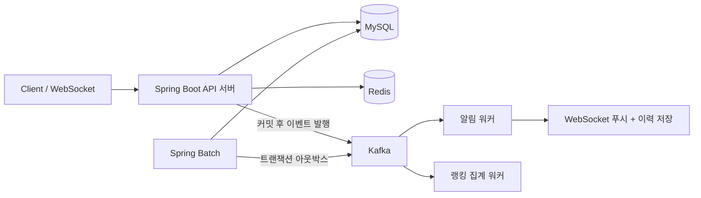
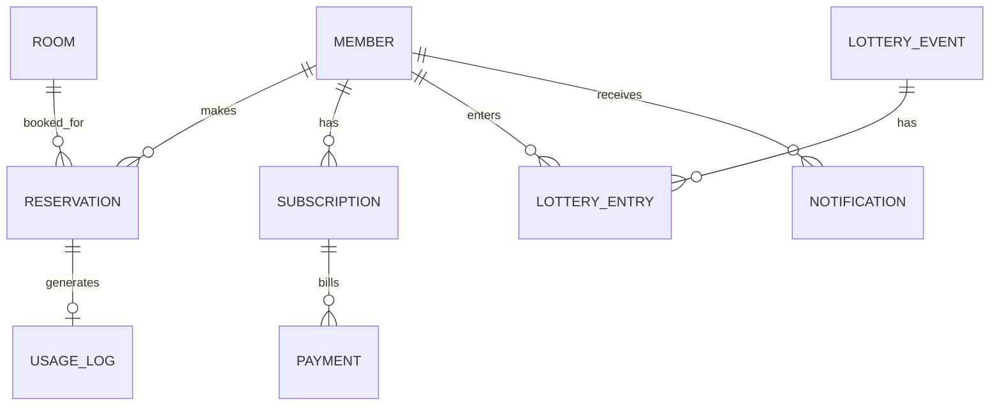

# 스터디룸 예약 시스템 — 백엔드 포트폴리오 프로젝트 로드맵

> 예약 + 이벤트 추첨 + 알림 + 실시간 랭킹 + 정기 구독권을 하나의 도메인으로 묶은 올인원 백엔드 프로젝트

---

## 0. 프로젝트 한 줄 정의

스터디룸을 예약/이용하는 서비스를 중심으로, **동시성 제어 · 캐싱 · 비동기 메시징 · 배치 · 실시간 통신**이라는 백엔드 핵심 역량을 자연스럽게 녹여낸 프로젝트. 기능이 5개로 보이지만 실제로는 "예약"이라는 하나의 도메인 이벤트를 중심으로 나머지 4개가 파생되는 구조라, 도메인 일관성을 유지하면서도 각 기술을 깊이 있게 다룰 수 있습니다.

**왜 이 구조가 유효한가**
- 이벤트 추첨 = 예약(이용중) 데이터를 활용
- 알림 = 예약/이벤트/구독에서 발생하는 도메인 이벤트를 구독해서 발송
- 랭킹 = 예약 종료(퇴실) 시점의 이용시간 데이터를 집계
- 구독권 = 예약 시 요금/우선순위에 영향을 주는 결제 도메인

즉 기능을 5개 만드는 게 아니라, **하나의 예약 이벤트가 4개의 하위 시스템으로 전파되는 구조**로 설계하면 억지스럽지 않고 실무적인 아키텍처가 됩니다.

---

## 1. 전체 아키텍처 개요

> 아래는 **초기 스케치**다. 최종 구조는 [`../README.md`](../README.md) 아키텍처 절 참고
> (메시지 큐는 Kafka 로 확정, 알림은 이메일 없이 WebSocket + DB 이력, Batch 는 아웃박스 경유).



- **API 서버**: 예약/회원/구독 등 핵심 도메인 처리 (동기)
- **Redis**: 좌석 홀딩 TTL, 분산락, 실시간 랭킹(Sorted Set), 캐싱
- **Kafka**: 추첨/공지/퇴실/구독결제 도메인 이벤트를 비동기 전파. 세 스트림
  (`notification-events` / `usage-events` / `subscription-events`)을 타입별 컨테이너 팩토리로 분리
- **알림 워커**: 큐를 구독해 이력 저장(멱등) + WebSocket 푸시. 재시도 → DLT
- **랭킹 워커**: 퇴실 이벤트를 구독해 Redis Sorted Set 갱신
- **Spring Batch**: 정기 구독 결제 (정산·통계 집계는 범위 밖)

---

## 2. 도메인 모델 (ERD 개요)



> 예약↔구독은 FK 로 잇지 않는다 — 구독 혜택(홀딩 유예 연장)은 `HoldTtlPolicy` 포트로
> 느슨하게 결합한다. "우선예약권"은 계획에만 있었고 구현하지 않았다(§11).

| 엔티티 | 핵심 컬럼 | 비고 |
|---|---|---|
| Member | id, email, name, role | JWT 인증 대상. 구독 상태는 Subscription 에 |
| Room | id, name, capacity | ~~status~~ 3단계에서 제거 — 시간대 단위 예약이라 룸 단일 상태값이 무의미, 가용성은 예약 겹침 + Redis 홀딩으로 판단 |
| Reservation | id, memberId, roomId, startAt, endAt, status, checkedOutAt, version | `@Version` 은 취소·퇴실 UPDATE 경합 방어용 (오버부킹은 §3-1 참고) |
| UsageLog | id, memberId, roomId, duration, reservationId(UNIQUE) | 랭킹 집계 소스, 퇴실 시 생성, reservationId 로 멱등 |
| LotteryEvent | id, audience, status, seed | ADMIN "지금 추첨" — 예약된 시점(targetTime) 없음. seed 로 재현 |
| LotteryEntry | id, eventId, memberId, isWinner | |
| Subscription | id, memberId(UNIQUE), plan, nextBillingAt, status | |
| Payment | id, subscriptionId, amountKrw, status, idempotencyKey(UNIQUE) | `sub:{id}:{yyyy-MM}` |
| Notification | id, memberId, type, title, body, status, dedupKey(UNIQUE), readAt | 단일 채널(in-app + WS), `channel` 컬럼 없음 |

> 인프라성 테이블: `outbox_events` · Spring Batch 메타데이터(`BATCH_*`, V7)는 8단계, `usage_logs` 는 7단계. ERD 에는 도메인 엔티티만 표기.

---

## 3. 기능 모듈별 상세 설계

### 3-1. 예약 시스템 (Core)

**흐름**: 룸 선택 → 홀딩(10분) → 확정 → 이용 → 퇴실

| 문제 | 해결 기법 | 학습 포인트 |
|---|---|---|
| 동시에 같은 룸을 여러 명이 클릭 | 락 없음 → DB 비관적 락 → Redisson 분산 락 (전략 전환, 부하 비교) | 락 종류별 트레이드오프. **낙관적 락은 INSERT-vs-INSERT 오버부킹을 못 막아 미채택** ([`troubleshooting.md`](./troubleshooting.md)) |
| 홀딩 후 확정 안 하고 이탈 | Redis TTL 자동 삭제 | keyspace 만료 이벤트 → 홀딩 키 정리 + 캐시 무효화, 스케줄러 백스톱 병행 (이벤트는 신뢰성 보장 X) |
| 실시간 좌석 상태 반영 | WebSocket/STOMP 브로드캐스트 | 기존 Socket.IO 경험 확장 |
| 예약 취소/변경 정합성 | 상태 전이 가드 (enum + 전이 조건 검사) | 잘못된 상태 전이 방지. 상태 3개(RESERVED/CANCELLED/COMPLETED)라 State Machine 라이브러리는 과함 |

**단계별 구현 순서 (권장)**
1. 락 없이 기본 CRUD 구현 → 일부러 동시성 버그 재현 (테스트로 증명)
2. DB 비관적락 적용 → 문제 해결하지만 성능 저하 확인
3. Redis 분산락(Redisson) 적용 → 성능 비교
4. 부하테스트(K6/nGrinder)로 세 방식의 처리량·오류율 수치 비교

> 이 "문제 재현 → 단계적 해결 → 수치로 증명" 과정을 README/블로그에 그대로 기록하는 것이 포트폴리오에서 가장 중요한 부분입니다.

### 3-2. 이벤트 추첨 시스템 (현재 이용중인 사람 대상)

- 추첨 대상은 **현재 이용 중인 회원**(`RESERVED` 이면서 추첨 순간이 `startAt <= now < endAt`) 또는
  **전체 회원**. (3단계에서 `Room.status` 제거)
- ADMIN이 "지금 추첨"으로 실행 → 당첨자 개인 알림(6단계 파이프라인) + `/topic/lottery/{id}` 실시간 발표(4단계 WebSocket 재사용)
- 공정성 검증 가능: `SecureRandom` 으로 seed 생성 → `lottery_events.seed` 저장 → 후보를 memberId 정렬 후 `new Random(seed)` shuffle. 같은 (후보, seed, 인원)이면 언제든 같은 결과 → 분쟁 시 재실행 검증
- 동시성: `draw()` 는 Redisson 락 + `SCHEDULED → DRAWN` 가드 → 중복 클릭·다중 인스턴스에도 1회

### 3-3. 알림 시스템

당초 "전체 공지 = 큐, 즉시 알림 = WebSocket" 2패턴 분리를 계획했으나, **Kafka 컨슈머 왕복이
ms 단위라 단일 파이프라인으로 통일**했다(§11). 즉시성은 워커가 소비 직후 WebSocket 으로 밀어
충족하고, 이벤트 타입만 리스너별 컨테이너 팩토리로 분리한다.

```
추첨 결과 / 전체 공지 ─▶ notification-events ─▶ 워커 ─┬─ dedup_key 멱등 저장 (notifications)
                                                      ├─ 발송 (실패 시 재시도)
                                                      └─ WebSocket /topic/notifications/{memberId}
```

- 발송 실패 시 `@RetryableTopic` 지수 백오프(0.5s→1s→2s) → 소진 시 DLT(`-dlt`) 격리, 이력 `FAILED`
- 알림 이력(notifications)에 발송 상태 기록 → "발송 성공률 모니터링" 운영 관점
- `dedup_key` UNIQUE → at-least-once 재처리에도 1건

### 3-4. 실시간 랭킹 (최장 이용 시간)

- 퇴실 시 `usage_logs` 생성(`reservation_id` UNIQUE 멱등) → Kafka `usage-events` → 랭킹 워커가 `ZINCRBY` 로 갱신
- 전체(`ranking:all`) + 일간(`ranking:daily:{date}`, **TTL 48h** — 자정 배치 없이 자연 만료). 주간은 범위 밖(§11)
- 랭킹 조회는 Redis에서 바로 (`ZREVRANGE` / `ZREVRANK`+`ZSCORE`), DB 조회 없이 O(log N)
- Redis 유실 대비 `POST /api/rankings/rebuild`(ADMIN) 가 `usage_logs` 합계로 재구축
- 어필: "왜 Sorted Set 인가", "`ZINCRBY` 자체가 원자적이라 동시 갱신에도 정확 (10스레드×20회 → 200)"

### 3-5. 정기 구독권

- Spring Batch로 매일 자정 `nextBillingAt`이 도래한 구독 건을 조회해 결제 실행
- **트랜잭션 아웃박스 패턴**: 결제 성공 → 이벤트를 같은 트랜잭션 내 아웃박스 테이블에 기록 → 별도 릴레이(`FOR UPDATE SKIP LOCKED`)가 읽어 Kafka 에 발행 (결제와 이벤트 발행 사이 유실 방지)
- 결제 시 `idempotencyKey`(`sub:{id}:{yyyy-MM}`) UNIQUE 로 중복 결제 방지
- 구독자 혜택 = **PRO 회원 홀딩 유예 연장 (10분 → 20분)**. `HoldTtlPolicy` 포트로 예약↔구독 느슨한 결합.
  ("우선예약권", "요금 할인"은 계획에만 있었고 구현하지 않았다 — §11)

---

## 4. 기술 스택 총정리

| 분류 | 기술 | 비고 |
|---|---|---|
| 언어/프레임워크 | Java 17, Spring Boot 3 | 기존 경험 연속성 |
| 인증 | Spring Security + JWT | 기존 프로젝트 재사용 가능 |
| ORM | JPA(Hibernate), QueryDSL(선택) | 복잡 조회에 QueryDSL 추가 시 어필 포인트 ↑ |
| DB | MySQL, Flyway(마이그레이션) | 기존 경험 |
| 캐시/락 | Redis, Redisson | 신규 |
| 메시징 | Kafka 또는 RabbitMQ | 신규, 입문은 RabbitMQ가 더 쉬움 |
| 배치 | Spring Batch | 신규 |
| 실시간 | WebSocket(STOMP) | 기존 Socket.IO 경험 확장 |
| 테스트 | JUnit5, Mockito, Testcontainers | 신규 — 반드시 포함 |
| 부하테스트 | K6 또는 nGrinder | 신규 |
| 문서화 | Swagger/OpenAPI | 신규 |
| 인프라 | Docker, AWS EC2 (1회성 검증 후 삭제), 상시 데모는 무료 티어(Render·Vercel·TiDB·Upstash·Confluent) | 프리티어 소진 → §11 |
| CI/CD | GitHub Actions (빌드·테스트·이미지), Render/Vercel Git 연동 배포 | 기존 Jenkins 경험 확장 |

---

## 5. 인프라 & 배포

> 초기 계획은 "AWS EC2 + RDS 상시 운영 + Actions → EC2 배포 파이프라인"이었으나,
> 프리티어 소진 후 상시 EC2 비용 부담으로 방향을 바꿨다 (§11).

- **로컬** — Docker Compose (MySQL · Redis · Kafka · kafka-ui)
- **AWS 경험** — 전체 스택을 EC2 t3.medium 에 `docker compose` 로 올려 [`../deploy/verify.sh`](../deploy/verify.sh)
  16종 통과 확인 → **인스턴스·볼륨 완전 삭제** (1회성 ~$0.01, 근거 [`deploy/`](./deploy/))
- **상시 데모** — 프론트 Vercel · 백엔드 Render(Docker) · MySQL TiDB Cloud · Redis Upstash ·
  Kafka Confluent Cloud Basic. `main` push 시 Render/Vercel 이 Git 연동으로 자동 재배포 ([`../deploy/RENDER.md`](../deploy/RENDER.md))
- **CI** — `.github/workflows/ci.yml` (backend `gradlew build` + Testcontainers / frontend 빌드 / 이미지 빌드)
- **부하테스트** — 로컬 + AWS EC2 두 환경에서 재측정 ([`performance.md`](./performance.md)).
  운영 유사 스펙에서 처리량이 오를 걸로 봤으나, t3.medium(2 vCPU)에 앱·인프라·k6 를 다 얹어
  오히려 낮았다 — 절대 수치의 환경 종속성을 확인 (§11)

---

## 6. 테스트 전략

| 테스트 종류 | 도구 | 무엇을 검증 |
|---|---|---|
| 단위 테스트 | JUnit5 + Mockito | 서비스 로직, 예외 케이스 |
| 통합 테스트 | Testcontainers(MySQL, Redis) | 실제 DB/캐시와의 상호작용 |
| 동시성 테스트 | `ExecutorService`로 멀티스레드 시뮬레이션 | 락 적용 전/후 재고·정합성 비교 |
| 부하 테스트 | K6/nGrinder | TPS, 오류율, 응답시간 (락 방식별 비교표 작성) |

> 테스트 커버리지 숫자보다 "동시성 버그를 어떻게 테스트로 재현하고 검증했는가"가 훨씬 설득력 있습니다.

---

## 7. 개발 로드맵 (단계별 제안)

혼자 진행하시는 만큼 아래는 참고용 순서이며, 기간은 본인 페이스에 맞게 조정하세요.

- [x] **1단계 — 코어 도메인**: 회원 인증(JWT), 룸/예약 기본 CRUD, Swagger 문서화
- [x] **2단계 — 동시성**: 락 없는 버전 → 비관적락 → Redisson 분산락 → 동시성 테스트 + 비교 기록
- [x] **3단계 — 캐싱/홀딩**: Redis TTL 기반 좌석 홀딩(10분) + keyspace 만료 이벤트/백스톱, 룸 목록·현황 Redis 캐싱, 30분 슬롯
- [x] **4단계 — 실시간**: WebSocket/STOMP로 룸 현황 변경(홀딩·예약·만료)을 `/topic/rooms/{id}` 브로드캐스트, 프론트 실시간 타임라인
- [x] **5단계 — 이벤트 추첨**: 대상(현재 이용중 / 전체) 중 ADMIN 추첨 + 시드 기반 재현 가능한 추첨(Redisson 락·상태 가드) + `@TransactionalEventListener` → `/topic/lottery` 발표
- [x] **6단계 — 메시징/알림**: Kafka 도입, 추첨/공지 → 알림 워커(`@KafkaListener`), 멱등(`dedup_key`), `@RetryableTopic` 재시도 + DLT, DB 이력 + WebSocket 푸시
- [x] **7단계 — 랭킹**: 퇴실(수동+백스톱) → Kafka `usage-events` → 랭킹 워커가 `usage_logs`(멱등) + Redis Sorted Set `ZINCRBY`(전체/일간), `ZREVRANGE` 조회, ADMIN 재구축
- [x] **8단계 — 구독/배치**: Spring Batch 일일 정기결제, 트랜잭션 아웃박스(`outbox_events` + `SKIP LOCKED` 릴레이 → Kafka), `idempotency_key` UNIQUE 중복결제 방지, PRO 홀딩 연장(도메인 연계)
- [x] **9단계 — 인프라/CI-CD**: 백엔드/프론트 Docker 이미지 + nginx 리버스 프록시, GitHub Actions CI(빌드·테스트·이미지), AWS EC2 전체 스택 배포 검증 후 비용 최소화 위해 인스턴스 삭제(1회성 ~$0.01), 상시 데모는 Render+Vercel+TiDB+Upstash+Confluent 무료 티어
- [x] **10단계 — 부하테스트 & 문서 정리**: k6 6개 시나리오를 로컬 + AWS EC2 두 환경에서 재측정(`docs/performance.md`) — 락 전략 3종·캐시 전후·랭킹·구독·알림 팬아웃, 절대 수치는 환경 종속이라 상대 비교 중심. README 성능 섹션 정리

각 단계가 끝날 때마다 "무엇이 문제였고, 어떻게 해결했는가"를 짧게라도 기록해두면 이후 README 작성이 훨씬 수월합니다.

---

## 8. 깃허브 기록 전략

- **커밋 컨벤션**: `feat:`, `fix:`, `refactor:`, `test:`, `docs:` 등으로 일관성 유지 (자세한 규칙은 8-1 참고)
- **브랜치 전략**: 아래 8-1에 별도 정리 — 혼자 진행해도 협업 습관을 보여줄 수 있도록 이슈 → 브랜치 → PR → self-review → 머지 흐름을 지킨다
- **README 구성 권장 순서**: 프로젝트 소개 → 아키텍처 다이어그램 → 기술 스택 → 핵심 트러블슈팅(동시성/성능 비교 표 포함) → 실행 방법 → API 문서 링크
- **트러블슈팅 문서 별도 관리**: `docs/troubleshooting.md`에 "동시성 이슈 해결 과정", "캐시 무효화 전략 고민" 등을 타임라인으로 기록 — 면접에서 그대로 이야깃거리가 됨
- **성능 비교 결과**: 락 방식별/캐싱 적용 전후 TPS·응답시간을 표나 그래프로 README에 포함

---

## 8-1. 브랜치 전략

혼자 진행하지만 **협업 팀에 들어갔을 때 바로 적응 가능하다**는 것을 보여주는 게 목적입니다. 무거운 Git Flow 대신, CI/CD·지속 배포와 잘 맞는 **GitHub Flow 기반**으로 단순하게 운영합니다.

### 브랜치 종류

| 브랜치 | 역할 | 규칙 |
|---|---|---|
| `main` | 항상 배포 가능한 안정 상태 | 직접 push 금지, PR 머지로만 갱신, CI 통과 필수 |
| `feature/*` | 기능 개발 | `main`에서 분기, 머지 후 삭제 |
| `fix/*` | 버그 수정 | 〃 |
| `refactor/*`, `test/*`, `docs/*`, `chore/*` | 그 외 작업 유형별 | 〃 |

> `develop` 통합 브랜치는 두지 않는다. 1인 개발에서 `main`↔`develop` 이중 관리는 비용만 크고, 로드맵의 "단계별로 동작하는 상태를 유지" 목표와도 맞지 않는다.

### 네이밍

```
<타입>/<이슈번호>-<간단한-요약(영문 kebab-case)>
```

예: `feature/12-jwt-authentication`, `fix/27-holding-ttl-not-released`, `test/31-reservation-concurrency`

### 작업 흐름

1. **작업 단위 정의** — 로드맵 단계/작업 단위로 브랜치를 판다. 이 로드맵 문서가 이슈 역할을 한다
   (배경·완료 조건이 여기 있음). 별도 GitHub Issue·마일스톤은 두지 않았다 — 1인 규모에선 로드맵 +
   PR 로 충분. 팀 규모면 이슈부터 만든다. *(§11 — 실제와 일치)*
2. **브랜치 분기** — 최신 `main`에서 `<타입>/<단계번호>-<요약>` 생성.
3. **커밋** — 커밋 컨벤션(아래) 준수, 작은 단위로 자주.
4. **PR 생성** — `main` 대상. 제목은 커밋 컨벤션과 동일 형식.
5. **self-review** — 본인이 PR의 "Files changed"를 직접 리뷰하고, 리뷰 코멘트/스크린샷/부하테스트 결과를 남긴다. CI(빌드+테스트) 통과 확인.
6. **머지** — **merge commit** (단계별 커밋을 히스토리에 보존해 점진 개발 과정을 남긴다). 머지 후 브랜치 삭제.
7. **단계 완료 태그** — 로드맵 한 단계가 끝나면 `git tag`로 `step-1-core-domain` 형태의 태그를 남겨 "이 시점에 무엇이 동작했는지" 추적 가능하게 한다.

### 커밋 컨벤션

```
<타입>: <제목 (한글 가능, 50자 이내, 마침표 없음)>

<본문 - 무엇을/왜 바꿨는지. 어떻게는 코드로 충분>
```

타입: `feat`, `fix`, `refactor`, `test`, `docs`, `chore`, `build`, `perf`

### PR 템플릿

[`.github/pull_request_template.md`](../.github/pull_request_template.md) — 무엇을 / 왜 / 어떻게 / 확인 체크리스트.

### 초기 스캐폴딩 예외

프로젝트 최초 골격(빌드 설정, Docker Compose, 로드맵 문서, 헬스체크)은 `main`에 직접 커밋한다. **이 시점 이후의 모든 변경은 위 흐름을 따른다.**

---

## 9. 포트폴리오 어필 포인트 매핑

| 기능 | 면접에서 어필할 포인트 |
|---|---|
| 동시성 제어 | "낙관적 락이 왜 이 케이스(INSERT 경합)를 못 막는가", "비관적 락 vs 분산 락 — 단일 인스턴스면 뭘 고르나" |
| Redis 캐싱/랭킹 | "캐시 무효화 지점을 한 곳(`RoomChangeNotifier`)으로 모은 이유", "Sorted Set + `ZINCRBY` 원자성" |
| 메시징 | "동기 발송이면 엔드포인트가 팬아웃을 다 기다린다", "재시도 백오프 → DLT, `dedup_key` 멱등" |
| 배치/아웃박스 | "결제·상태변경·발행을 한 트랜잭션으로 — 브로커가 죽어도 outbox 에 남는다" |
| 테스트 | "8스레드가 같은 주기를 결제 → `idempotency_key` UNIQUE 로 1건" |
| 인프라 | "AWS 배포는 1회성 검증으로 경험만, 상시는 비용 0 무료 티어 — 왜 그렇게 나눴나" (§11) |

---

## 10. 최종 체크리스트

- [x] 동시성 문제를 재현하고 해결하는 과정을 수치로 증명했는가 — 락 3전략 부하 비교([`performance.md`](./performance.md))
- [x] 테스트 코드(단위+통합+동시성)가 실제로 존재하는가 — Testcontainers 통합 + `ExecutorService` 동시성 테스트
- [x] 비동기 메시징의 실패 처리(재시도/DLQ)까지 구현했는가 — `@RetryableTopic` → DLT, `failure-rate 0.3` → 0.79%
- [x] Redis를 캐시뿐 아니라 락/랭킹 등 다목적으로 활용했는가 — 캐시 · Redisson 락 · TTL 홀딩 · Sorted Set
- [x] AWS 인프라를 직접 구성해봤는가 (PaaS에만 의존하지 않았는가) — EC2 전체 스택 배포 검증(1회성, CLI 전 과정)
- [x] README와 트러블슈팅 문서가 "문제-해결-검증" 구조로 작성되었는가

---

## 11. 계획 대비 주요 변경점

계획대로 되지 않았거나, 진행 중 더 나은 방향을 택한 지점들. *(왜 바꿨는지가 이 프로젝트의 판단 근거)*

| 항목 | 계획 | 실제 | 이유 |
|---|---|---|---|
| **상시 인프라** | AWS EC2 상시 운영 + RDS(MySQL) + Actions→EC2 배포 파이프라인 | EC2는 **1회성 검증 후 삭제** · MySQL=TiDB Cloud Serverless · CD=Render/Vercel Git 연동 | 프리티어 소진 → 상시 EC2 비용 부담. "AWS 배포 경험"은 1회성 검증(CLI 전 과정·로그·캡처)으로 확보하고, 상시 데모는 월 $0 무료 티어 조합으로 |
| **관리형 Kafka** | (미정) | **Confluent Cloud Basic** | Upstash Kafka 가 2025-03 종료 → 무료로 상시 가능한 관리형 Kafka 가 사실상 Confluent Basic(클러스터 요금 없음)뿐 |
| **알림 발송 패턴** | 전체=큐 / 즉시=WebSocket, 2패턴 분리 | **단일 Kafka 파이프라인** + 소비 직후 WebSocket 푸시 | 컨슈머 왕복이 ms 단위라 "즉시성"을 단일 경로로 충족. 대신 이벤트 타입별 컨테이너 팩토리로 역직렬화 분리 |
| **동시성 락** | 분산 락 + 낙관적 락 병행 | 낙관적 락 **미채택**(`@Version` 컬럼은 유지) | 오버부킹은 INSERT-vs-INSERT — 기존 행이 없어 `@Version` 으로 못 막는다. `@Version` 은 취소·퇴실 UPDATE 경합 방어용으로만 |
| **일간 랭킹 초기화** | 자정 배치로 리셋 | `ranking:daily:{date}` 키에 **TTL 48h** | 날짜별 키 + TTL 이면 배치 없이 자연 만료. 스케줄러 하나 덜 만듦 |
| **머지 전략** | Squash and merge | **merge commit** | 단계별 커밋(96개)을 히스토리에 보존해 점진 개발 과정을 남김 |
| **이슈 트래킹** | GitHub Issue + 마일스톤 | 로드맵 문서 + PR | 1인 규모에선 로드맵이 이슈 역할. 팀이면 이슈부터 |
| **10단계 부하 측정** | 운영 유사 스펙에서 처리량 상승 기대 | EC2 t3.medium 이 로컬보다 **낮음** | 2 vCPU 에 앱·인프라·k6 동거. "절대 수치는 환경 종속, 상대 비교만 유효"를 측정으로 확인 |

**범위 밖(계획에만 존재)**: 우선예약권, 구독 요금 할인, 주간 랭킹, QueryDSL, RabbitMQ, 정산·통계 집계 배치, 이메일/푸시 발송 채널.
