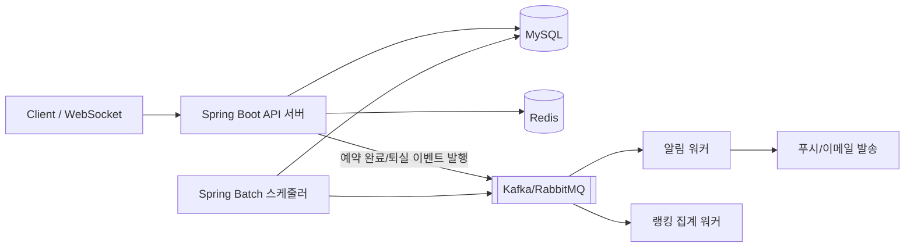
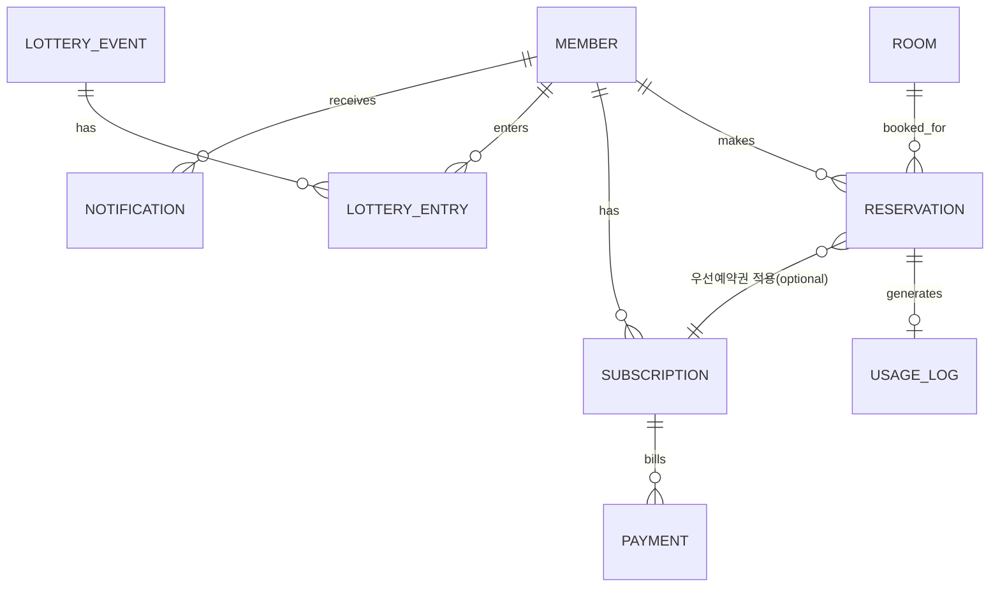

# 스터디룸 예약 시스템 — 백엔드 포트폴리오 프로젝트 로드맵

> 예약 + 이벤트 추첨 + 알림 + 실시간 랭킹 + 정기 구독권을 하나의 도메인으로 묶은 올인원 백엔드 프로젝트

---

## 0. 프로젝트 한 줄 정의

스터디룸을 예약/이용하는 서비스를 중심으로, **동시성 제어 · 캐싱 · 비동기 메시징 · 배치 · 실시간 통신**이라는 백엔드 핵심 역량을 자연스럽게 녹여낸 프로젝트. 기능이 5개로 보이지만 실제로는 "예약"이라는 하나의 도메인 이벤트를 중심으로 나머지 4개가 파생되는 구조라, 도메인 일관성을 유지하면서도 각 기술을 깊이 있게 다룰 수 있습니다.

**왜 이 구조가 유효한가**
- 이벤트 추첨 = 예약(이용중) 데이터를 활용
- 알림 = 예약/이벤트/구독에서 발생하는 도메인 이벤트를 구독해서 발송
- 랭킹 = 예약 종료(퇴실) 시점의 이용시간 데이터를 집계
- 구독권 = 예약 시 요금/우선순위에 영향을 주는 결제 도메인

즉 기능을 5개 만드는 게 아니라, **하나의 예약 이벤트가 4개의 하위 시스템으로 전파되는 구조**로 설계하면 억지스럽지 않고 실무적인 아키텍처가 됩니다.

---

## 1. 전체 아키텍처 개요



- **API 서버**: 예약/회원/구독 등 핵심 도메인 처리 (동기)
- **Redis**: 좌석 홀딩 TTL, 분산락, 실시간 랭킹(Sorted Set), 캐싱
- **메시지 큐**: 예약 완료/퇴실/구독 결제 등 도메인 이벤트를 비동기로 전파
- **알림 워커**: 큐를 구독해 알림 발송 (전체 회원 / 현재 이용중 회원 분리)
- **랭킹 워커**: 퇴실 이벤트를 구독해 Redis Sorted Set 갱신
- **Spring Batch**: 정기 구독 결제, 정산, 통계 집계를 스케줄 기반으로 처리

---

## 2. 도메인 모델 (ERD 개요)



| 엔티티 | 핵심 컬럼 | 비고 |
|---|---|---|
| Member | id, email, role, subscriptionStatus | JWT 인증 대상 |
| Room | id, name, capacity, status | 상태: AVAILABLE/HOLDING/OCCUPIED |
| Reservation | id, memberId, roomId, startAt, endAt, status, version | 낙관적락용 version 컬럼 |
| UsageLog | id, memberId, roomId, duration | 랭킹 집계 소스, 퇴실 시 생성 |
| LotteryEvent | id, targetTime, status | "현재 이용중" 스냅샷 기준 시점 |
| LotteryEntry | id, eventId, memberId, isWinner | |
| Subscription | id, memberId, plan, nextBillingAt, status | |
| Payment | id, subscriptionId, amount, status, idempotencyKey | 멱등키 필수 |
| Notification | id, memberId, type, channel, status | 발송 이력 |

---

## 3. 기능 모듈별 상세 설계

### 3-1. 예약 시스템 (Core)

**흐름**: 룸 선택 → 홀딩(5~10분) → 결제/확정 → 이용 → 퇴실

| 문제 | 해결 기법 | 학습 포인트 |
|---|---|---|
| 동시에 같은 룸을 여러 명이 클릭 | Redis 분산락(Redisson) + DB 낙관적락(버전) 병행 | 락 종류별 트레이드오프 설명 가능 |
| 홀딩 후 결제 안 하고 이탈 | Redis TTL로 자동 해제 | TTL 만료 이벤트 → 룸 상태 원복 |
| 실시간 좌석 상태 반영 | WebSocket/STOMP 브로드캐스트 | 기존 WebRTC/Socket.IO 경험 재사용 |
| 예약 취소/변경 정합성 | 상태 전이(State Machine)로 관리 | 잘못된 상태 전이 방지 |

**단계별 구현 순서 (권장)**
1. 락 없이 기본 CRUD 구현 → 일부러 동시성 버그 재현 (테스트로 증명)
2. DB 비관적락 적용 → 문제 해결하지만 성능 저하 확인
3. Redis 분산락(Redisson) 적용 → 성능 비교
4. 부하테스트(K6/nGrinder)로 세 방식의 처리량·오류율 수치 비교

> 이 "문제 재현 → 단계적 해결 → 수치로 증명" 과정을 README/블로그에 그대로 기록하는 것이 포트폴리오에서 가장 중요한 부분입니다.

### 3-2. 이벤트 추첨 시스템 (현재 이용중인 사람 대상)

- 특정 시점에 `OCCUPIED` 상태인 예약을 스냅샷으로 조회 → 응모자 목록 생성
- 스케줄러(Spring Scheduler)가 정해진 시간에 추첨 실행, 당첨자에게 알림 발행
- 랜덤 추첨 로직은 단순 `Random`보다 **공정성 검증이 가능한 방식**(예: 시드 고정 + 로그 기록)으로 설계하면 신뢰성 어필 가능
- 확장 포인트: 당첨자 발표를 WebSocket으로 실시간 브로드캐스트

### 3-3. 알림 시스템

두 가지 발송 패턴을 분리해서 설계하는 것이 포인트입니다.

| 대상 | 특징 | 처리 방식 |
|---|---|---|
| 전체 회원 대상 (이벤트 공지 등) | 대량, 지연 허용 | Kafka/RabbitMQ + 배치성 워커, 재시도 + DLQ |
| 현재 이용중인 회원 대상 (당첨 알림, 종료 임박 알림 등) | 소량, 즉시성 중요 | WebSocket 또는 즉시 큐 처리 |

- 발송 실패 시 재시도 정책(exponential backoff) + 최종 실패는 DLQ로 격리
- 알림 이력(Notification 테이블)에 발송 상태 기록 → "발송 성공률 모니터링" 같은 운영 관점 어필 가능

### 3-4. 실시간 랭킹 (최장 이용 시간)

- 퇴실 시 `UsageLog` 생성 → 이벤트 발행 → 랭킹 워커가 `Redis Sorted Set`의 누적 점수(ZINCRBY)로 갱신
- 랭킹 조회는 Redis에서 바로 (`ZREVRANGE`), DB 조회 없이 O(log N) 성능
- 확장 포인트: 일간/주간/전체 랭킹을 Sorted Set 여러 개로 분리, 자정 배치로 일간 랭킹 초기화
- 조회수/좋아요형 어뷰징과 달리 "실제 이용시간"이라 조작 방지 로직은 상대적으로 단순 — 대신 "왜 Sorted Set을 썼는가", "동시 갱신 시 원자성을 어떻게 보장하는가(ZINCRBY 자체가 원자적)"를 설명할 수 있어야 함

### 3-5. 정기 구독권

- Spring Batch로 매일 자정 `nextBillingAt`이 도래한 구독 건을 조회해 결제 실행
- **트랜잭션 아웃박스 패턴**: 결제 성공 → 이벤트를 같은 트랜잭션 내 아웃박스 테이블에 기록 → 별도 프로세스가 아웃박스를 읽어 큐에 발행 (결제와 이벤트 발행 사이 데이터 유실 방지)
- 결제 API 호출 시 `idempotencyKey`로 중복 결제 방지
- 구독자 혜택을 예약 시스템과 연결 (예: 우선 홀딩 시간 연장, 요금 할인) → 도메인 간 연계 어필

---

## 4. 기술 스택 총정리

| 분류 | 기술 | 비고 |
|---|---|---|
| 언어/프레임워크 | Java 17, Spring Boot 3 | 기존 경험 연속성 |
| 인증 | Spring Security + JWT | 기존 프로젝트 재사용 가능 |
| ORM | JPA(Hibernate), QueryDSL(선택) | 복잡 조회에 QueryDSL 추가 시 어필 포인트 ↑ |
| DB | MySQL, Flyway(마이그레이션) | 기존 경험 |
| 캐시/락 | Redis, Redisson | 신규 |
| 메시징 | Kafka 또는 RabbitMQ | 신규, 입문은 RabbitMQ가 더 쉬움 |
| 배치 | Spring Batch | 신규 |
| 실시간 | WebSocket(STOMP) | 기존 Socket.IO 경험 확장 |
| 테스트 | JUnit5, Mockito, Testcontainers | 신규 — 반드시 포함 |
| 부하테스트 | K6 또는 nGrinder | 신규 |
| 문서화 | Swagger/OpenAPI | 신규 |
| 인프라 | Docker, AWS EC2+RDS(또는 최소 프리티어) | 기존 PaaS(Render/Railway)와 차별화 |
| CI/CD | GitHub Actions | 기존 Jenkins 경험 확장 |

---

## 5. 인프라 & 배포

- Docker Compose로 로컬에 MySQL/Redis/RabbitMQ 통합 개발 환경 구성
- AWS EC2에 애플리케이션 배포, RDS로 MySQL 운영 (프리티어로 충분히 가능)
- GitHub Actions로 빌드 → 테스트 → Docker 이미지 빌드 → EC2 배포 파이프라인 구성
- 부하테스트는 운영 환경과 유사한 스펙에서 진행 (로컬 결과와 차이 기록해두면 설명 포인트가 됨)

---

## 6. 테스트 전략

| 테스트 종류 | 도구 | 무엇을 검증 |
|---|---|---|
| 단위 테스트 | JUnit5 + Mockito | 서비스 로직, 예외 케이스 |
| 통합 테스트 | Testcontainers(MySQL, Redis) | 실제 DB/캐시와의 상호작용 |
| 동시성 테스트 | `ExecutorService`로 멀티스레드 시뮬레이션 | 락 적용 전/후 재고·정합성 비교 |
| 부하 테스트 | K6/nGrinder | TPS, 오류율, 응답시간 (락 방식별 비교표 작성) |

> 테스트 커버리지 숫자보다 "동시성 버그를 어떻게 테스트로 재현하고 검증했는가"가 훨씬 설득력 있습니다.

---

## 7. 개발 로드맵 (단계별 제안)

혼자 진행하시는 만큼 아래는 참고용 순서이며, 기간은 본인 페이스에 맞게 조정하세요.

- [x] **1단계 — 코어 도메인**: 회원 인증(JWT), 룸/예약 기본 CRUD, Swagger 문서화
- [ ] **2단계 — 동시성**: 락 없는 버전 → 비관적락 → Redisson 분산락 → 동시성 테스트 + 비교 기록
- [ ] **3단계 — 캐싱/홀딩**: Redis TTL 기반 홀딩, 룸 상태 캐싱
- [ ] **4단계 — 실시간**: WebSocket 좌석 상태 브로드캐스트
- [ ] **5단계 — 이벤트 추첨**: 스케줄러 기반 추첨 로직 + 당첨자 알림 발행
- [ ] **6단계 — 메시징/알림**: Kafka 또는 RabbitMQ 도입, 알림 워커, 재시도+DLQ
- [ ] **7단계 — 랭킹**: 퇴실 이벤트 → Redis Sorted Set 랭킹 집계
- [ ] **8단계 — 구독/배치**: Spring Batch 정기결제, 아웃박스 패턴, 멱등성 처리
- [ ] **9단계 — 인프라/CI-CD**: AWS 배포, GitHub Actions 파이프라인
- [ ] **10단계 — 부하테스트 & 문서 정리**: 성능 비교 수치화, README/블로그 최종 정리

각 단계가 끝날 때마다 "무엇이 문제였고, 어떻게 해결했는가"를 짧게라도 기록해두면 이후 README 작성이 훨씬 수월합니다.

---

## 8. 깃허브 기록 전략

- **커밋 컨벤션**: `feat:`, `fix:`, `refactor:`, `test:`, `docs:` 등으로 일관성 유지 (자세한 규칙은 8-1 참고)
- **브랜치 전략**: 아래 8-1에 별도 정리 — 혼자 진행해도 협업 습관을 보여줄 수 있도록 이슈 → 브랜치 → PR → self-review → 머지 흐름을 지킨다
- **README 구성 권장 순서**: 프로젝트 소개 → 아키텍처 다이어그램 → 기술 스택 → 핵심 트러블슈팅(동시성/성능 비교 표 포함) → 실행 방법 → API 문서 링크
- **트러블슈팅 문서 별도 관리**: `docs/troubleshooting.md`에 "동시성 이슈 해결 과정", "캐시 무효화 전략 고민" 등을 타임라인으로 기록 — 면접에서 그대로 이야깃거리가 됨
- **성능 비교 결과**: 락 방식별/캐싱 적용 전후 TPS·응답시간을 표나 그래프로 README에 포함

---

## 8-1. 브랜치 전략

혼자 진행하지만 **협업 팀에 들어갔을 때 바로 적응 가능하다**는 것을 보여주는 게 목적입니다. 무거운 Git Flow 대신, CI/CD·지속 배포와 잘 맞는 **GitHub Flow 기반**으로 단순하게 운영합니다.

### 브랜치 종류

| 브랜치 | 역할 | 규칙 |
|---|---|---|
| `main` | 항상 배포 가능한 안정 상태 | 직접 push 금지, PR 머지로만 갱신, CI 통과 필수 |
| `feature/*` | 기능 개발 | `main`에서 분기, 머지 후 삭제 |
| `fix/*` | 버그 수정 | 〃 |
| `refactor/*`, `test/*`, `docs/*`, `chore/*` | 그 외 작업 유형별 | 〃 |

> `develop` 통합 브랜치는 두지 않는다. 1인 개발에서 `main`↔`develop` 이중 관리는 비용만 크고, 로드맵의 "단계별로 동작하는 상태를 유지" 목표와도 맞지 않는다.

### 네이밍

```
<타입>/<이슈번호>-<간단한-요약(영문 kebab-case)>
```

예: `feature/12-jwt-authentication`, `fix/27-holding-ttl-not-released`, `test/31-reservation-concurrency`

### 작업 흐름

1. **이슈 생성** — 로드맵 단계/작업 단위로 GitHub Issue를 먼저 만든다 (배경·완료 조건 명시). 로드맵 10단계는 각각 **마일스톤**으로 등록.
2. **브랜치 분기** — 최신 `main`에서 `feature/<이슈번호>-...` 생성.
3. **커밋** — 커밋 컨벤션(아래) 준수, 작은 단위로 자주.
4. **PR 생성** — `main` 대상. 제목은 커밋 컨벤션과 동일 형식, 본문에 `Closes #<이슈번호>` 링크.
5. **self-review** — 본인이 PR의 "Files changed"를 직접 리뷰하고, 리뷰 코멘트/스크린샷/부하테스트 결과를 남긴다. CI(빌드+테스트) 통과 확인.
6. **머지** — **Squash and merge**로 커밋 히스토리를 깔끔하게. 머지 후 브랜치 삭제.
7. **단계 완료 태그** — 로드맵 한 단계가 끝나면 `git tag`로 `step-1-core-domain` 형태의 태그를 남겨 "이 시점에 무엇이 동작했는지" 추적 가능하게 한다.

### 커밋 컨벤션

```
<타입>: <제목 (한글 가능, 50자 이내, 마침표 없음)>

<본문 - 무엇을/왜 바꿨는지. 어떻게는 코드로 충분>

Closes #<이슈번호>
```

타입: `feat`, `fix`, `refactor`, `test`, `docs`, `chore`, `build`, `perf`

### PR 템플릿 (`.github/pull_request_template.md`)

```markdown
## 무엇을
<이 PR이 하는 일 한 줄 요약>

## 왜
<배경·문제>

## 어떻게
<핵심 구현 포인트, 트레이드오프>

## 확인
- [ ] 로컬 실행 확인
- [ ] 단위/통합 테스트 추가·통과
- [ ] (해당 시) 동시성/부하 테스트 결과 첨부

Closes #
```

### 초기 스캐폴딩 예외

프로젝트 최초 골격(빌드 설정, Docker Compose, 로드맵 문서, 헬스체크)은 `main`에 직접 커밋한다. **이 시점 이후의 모든 변경은 위 흐름을 따른다.**

---

## 9. 포트폴리오 어필 포인트 매핑

| 기능 | 면접에서 어필할 포인트 |
|---|---|
| 동시성 제어 | "왜 낙관적락이 아닌 분산락을 선택했는가", "락 범위를 최소화한 방법" |
| Redis 캐싱/랭킹 | "캐시 무효화 전략", "Sorted Set을 선택한 이유" |
| 메시징 | "왜 동기 대신 비동기로 처리했는가", "재시도/DLQ 설계" |
| 배치/아웃박스 | "결제와 이벤트 발행의 원자성을 어떻게 보장했는가" |
| 테스트 | "동시성 버그를 테스트로 어떻게 재현했는가" |
| 인프라 | "PaaS에서 IaaS로 넘어가며 무엇이 달라졌는가" |

---

## 10. 최종 체크리스트

- [ ] 동시성 문제를 재현하고 해결하는 과정을 수치로 증명했는가
- [ ] 테스트 코드(단위+통합+동시성)가 실제로 존재하는가
- [ ] 비동기 메시징의 실패 처리(재시도/DLQ)까지 구현했는가
- [ ] Redis를 캐시뿐 아니라 락/랭킹 등 다목적으로 활용했는가
- [ ] AWS 인프라를 직접 구성해봤는가 (PaaS에만 의존하지 않았는가)
- [ ] README와 트러블슈팅 문서가 "문제-해결-검증" 구조로 작성되었는가
